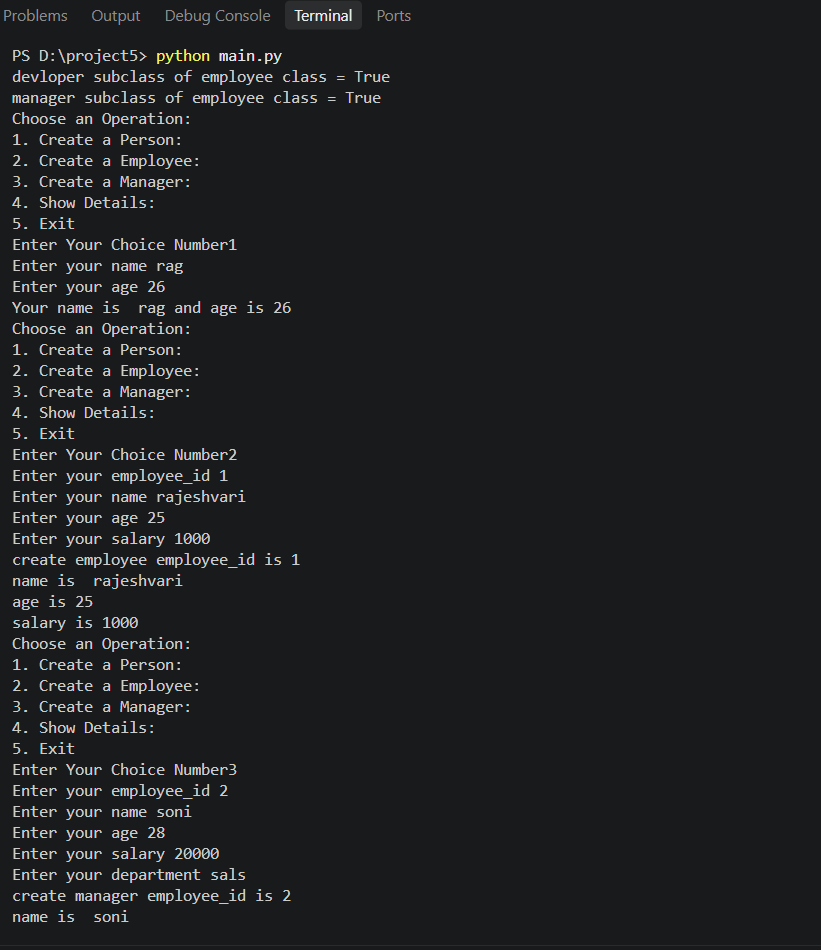

If you mean you want the **README content as Markdown source code** so you can copy it directly into `README.md`, use this:

````
 Employee_details

A simple **Employee Management System** built using **Python** and **Object-Oriented Programming (OOP)**.

# Features

- Create a Person
- Create an Employee
- Create a Manager
- Show Details
- Inheritance
- Encapsulation
- Constructor
- Destructor
- Getter and Setter
- Method Overriding
- `super()`
- `issubclass()`

# Classes

## Employee

The `Employee` class is the parent class.

```python
class Employee:

# Classes

## Employee

The `Employee` class is the parent class.

```python
class Employee:
````

 It contains:

```
Employee ID
Name
Age
Salary
```

 ## Manager

 The `Manager` class inherits from the `Employee` class.

```
class Manager(Employee):
```

 It contains:

```
Department
```

 ## Developer

 The `Devloper` class inherits from the `Employee` class.

```
class Devloper(Employee):
```

 It contains:

```
Programming Language
```

 # OOP Concepts

 ## Inheritance

```
class Manager(Employee):
    pass
```

```
class Devloper(Employee):
    pass
```

 ## Encapsulation

 Employee ID and salary are private attributes.

```
self.__Employee_id
self.__salary
```

 ## Getter and Setter

```
def set_id(self, Employee_id):
    self.__Employee_id = Employee_id

def get_id(self):
    return self.__Employee_id
```

```
def set_salary(self, salary):
    self.__salary = salary

def get_salary(self):
    return self.__salary
```

 ## Constructor

```
def __init__(self, Employee_id=None, name=None, age=None, salary=None):
    self.__Employee_id = Employee_id
    self.name = name
    self.age = age
    self.__salary = salary
```

 ## Destructor

```
def __del__(self):
    print("destructor called")
```

 ## Method Overriding

```
def display(self):
    super().display()
    print(self.department)
```

 ## super()

```
super().__init__(Employee_id, name, age, salary)
```

 ## issubclass()

```
issubclass(Devloper, Employee)
issubclass(Manager, Employee)
```

 Output:

```
devloper subclass of employee class = True
manager subclass of employee class = True
```

 # Menu

```
Choose an Operation:
1. Create a Person:
2. Create a Employee:
3. Create a Manager:
4. Show Details:
5. Exit
```

 # Create a Person

```
Name
Age
```

 # Create an Employee

```
Employee ID
Name
Age
Salary
```

 # Create a Manager

```
Employee ID
Name
Age
Salary
Department
```

 # Show Details

```
Choose details to show:
1. Person
2. Employee
3. Manager
```

 # How to Run

 ## Step 1

 Check Python installation:

```
python --version
```

 ## Step 2

 Run the Python file:

```
python employee.py
```

 # Project Structure

```
Employee-Management-System/
│
├── main.py
└── README.md
└── output.png
```

 # Technologies Used

```
Python
Object-Oriented Programming
```

 # Learning Objectives

```
Classes
Objects
Inheritance
Encapsulation
Constructors
Destructors
Getters
Setters
Method Overriding
super()
issubclass()
Menu-driven programming

```

# output


 # Note

 The original class name is `Devloper`.

 The correct spelling is:

```
class Developer(Employee):
```

```

```
